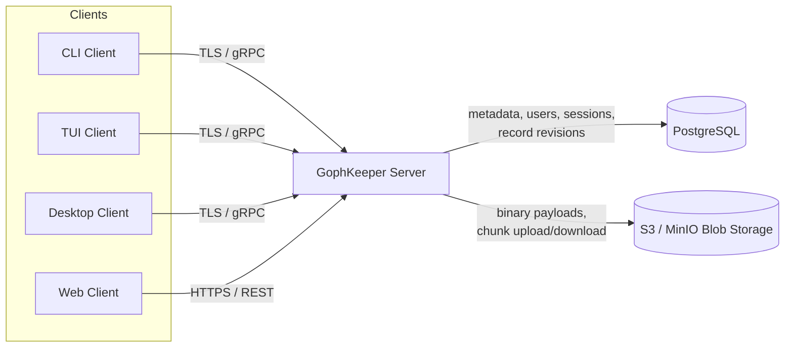
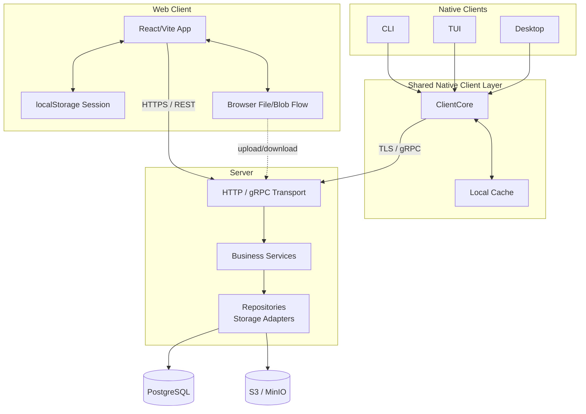
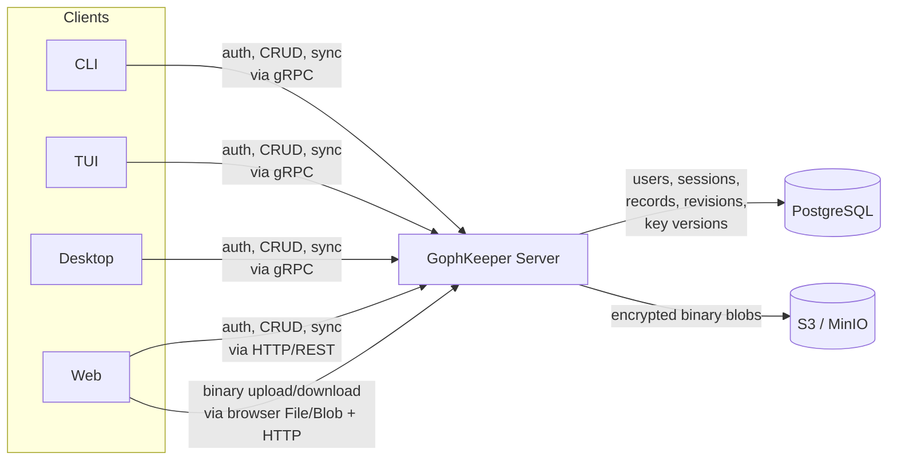
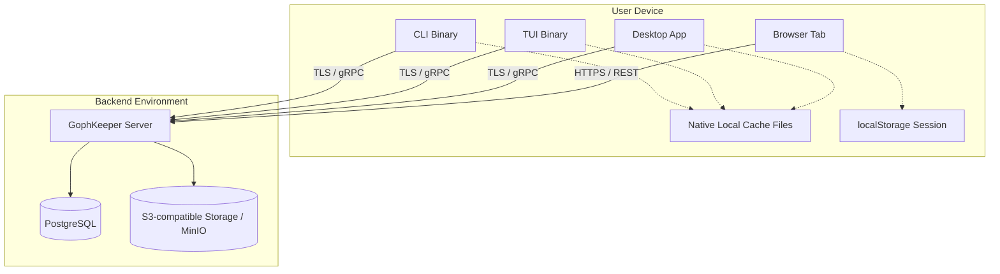
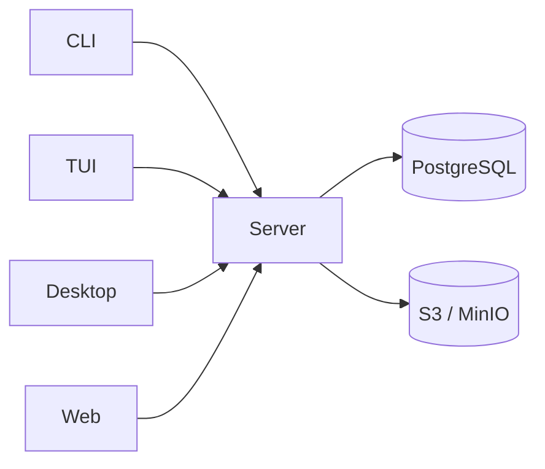

# Верхнеуровневые схемы архитектуры GophKeeper

Ниже несколько Mermaid-представлений одной и той же верхнеуровневой архитектуры.
Во всех вариантах отражены:

- клиенты: `CLI`, `TUI`, `Desktop`, `Web`
- `Server`
- `PostgreSQL`
- `S3-compatible Blob Storage` / `MinIO`

Дополнительно учтено текущее различие клиентских путей:

- `CLI`, `TUI`, `Desktop` показаны как native-клиенты
- `Web` показан как browser-клиент с `HTTP/REST` API, `localStorage`-сессией и browser `File/Blob` flow для binary-операций

## Вариант 1. Контекстная схема

Самый простой и читаемый вариант для README, overview и презентаций.

## Вариант 2. Слои и общие компоненты

Подходит, если хочется подчеркнуть, что разные клиенты используют общую клиентскую логику, а сервер разделён на transport/service/storage слои.

## Вариант 3. Потоки данных по типам

Более наглядный вариант, если важно отделить обычные записи от бинарных файлов.

## Вариант 4. Deployment view

Полезен для infra-обсуждений и описания runtime-размещения компонентов.

## Вариант 5. Самый компактный для README

Если нужна короткая схема без внутренних деталей.

## Какой вариант когда использовать

- `Вариант 1` — лучший общий overview
- `Вариант 2` — лучший для архитектурного описания кода
- `Вариант 3` — лучший для объяснения различия metadata и binary flow
- `Вариант 4` — лучший для deployment/runtime описания
- `Вариант 5` — лучший для краткого README-блока
