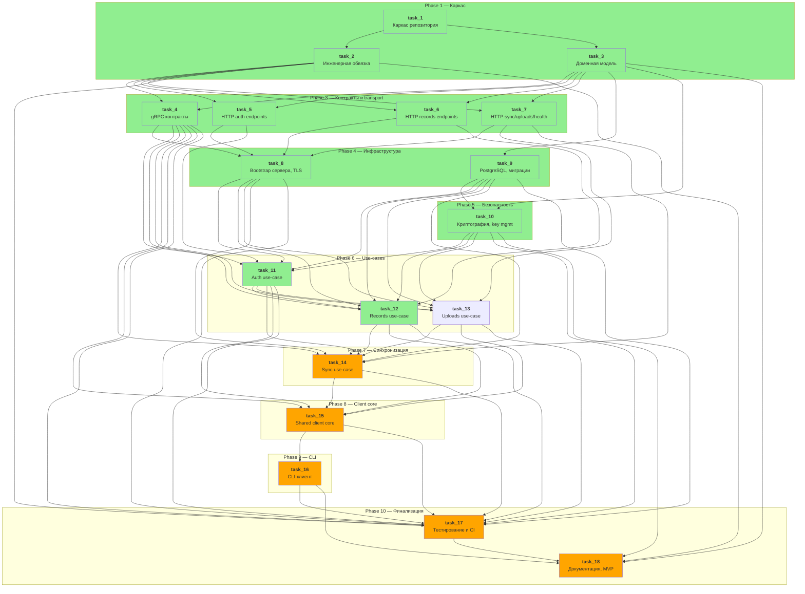

# Dependency Graph — gophkeeper



## Критический путь

```
task_1 → task_3 → task_9 → task_10 → task_11 → task_12 → task_14 → task_15 → task_16 → task_17 → task_18
```

## Параллельные группы (можно выполнять одновременно)

| Группа | Задачи |
|--------|--------|
| 1 | <span style="background-color: lightgreen;">task_1</span> |
| 2 | <span style="background-color: lightgreen;">task_2</span>, <span style="background-color: lightgreen;">task_3</span> |
| 3 | <span style="background-color: lightgreen;">task_4</span>, <span style="background-color: lightgreen;">task_5</span>, <span style="background-color: lightgreen;">task_6</span>, <span style="background-color: lightgreen;">task_7</span> |
| 4 | <span style="background-color: lightgreen;">task_8</span>, <span style="background-color: lightgreen;">task_9</span> |
| 5 | <span style="background-color: lightgreen;">task_10</span> |
| 6 | <span style="background-color: lightgreen;">task_11</span> |
| 7 | <span style="background-color: lightgreen;">task_12</span>, task_13 |
| 8 | task_14 |
| 9 | task_15 |
| 10 | task_16 |
| 11 | task_17, task_18 |
